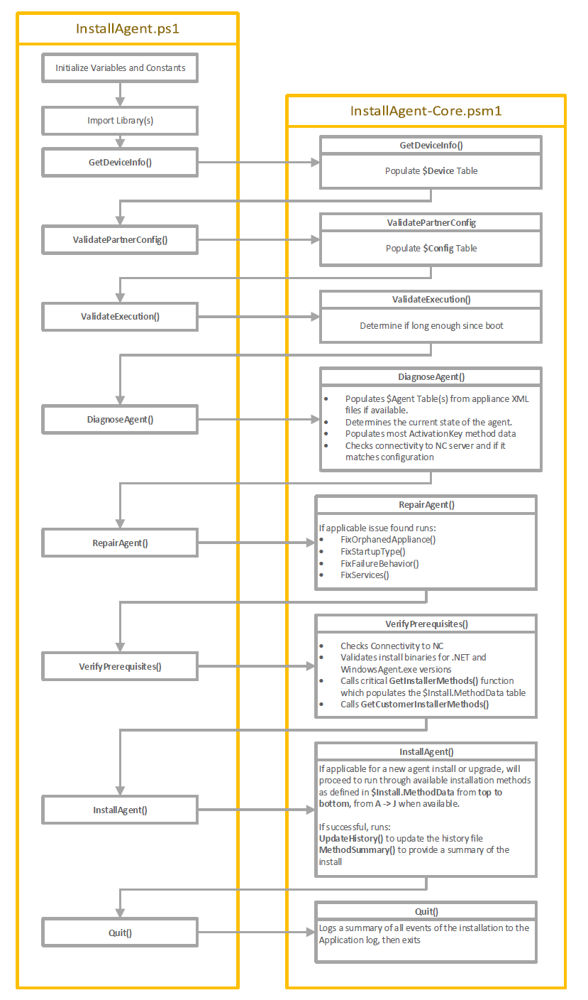

# Development and Debugging
## Overview
The PowerShell version of the InstallAgent package is uses highly structured, robust code with validation and logging at every step, these characteristics make it suitable for use in broad rollouts from small to enterprise businesses.

While it has many positive attributes it can be difficult to approach when re-developing or debugging. So let's provide a high level view of how the script would run under normal circumstances and highlighting the important parts:

While this doesn't represent all the functions inside of the InstallAgent-Core.psm1, we will explore it more in depth.

## Challenges and starting debugging
There are a number of challenges that you can run into when developing code for the InstallAgent package:
*   The Installagent.ps1 and the folder structure is intended to self delete after running, as it's intended to be run temporarily from C:\Windows\Temp\AGPO after the LaunchInstaller.bat/ps1 copies it there from the Netlogon/Source folder.
*   Functions in InstallAgent-Core.psm1 depend upon variables declared in InstallAgent.ps1 that exist in Script scope, this is opposed to functions that is passed parameters and all variables are private to it's scope
*   Functions will populate a number of variables with hashtables, their fields names and types are not declared anywhere in code.

The latter challanges are necessary artifacts caused by the constraints in PowerShell 2.0, to debug this code efficiently and cross reference variables it is necessary to use an IDE like Visual Studio Code or PowerShell ISE.

A point to set a debug point to see all the variables/tables populated and in a state to install or upgrade, I recommend put a breakpoint on the call to **SelectInstallMethod** function inside of the **InstallAgent** function at around line 3107 at time of writing.

Next either populate the PartnerConfig as outlined in the ReadMe.md and/or run the InstallAgent.ps1 with CustomerID/Token parameters, it's important to run the script with the dot source operator (period) and run it inside the [current session scope](https://devblogs.microsoft.com/powershell/powershell-constrained-language-mode-and-the-dot-source-operator/)

. .\InstallAgent.ps1 -CustomerID *CustomerID* -RegistrationToken *RegistrationToken* -LauncherPath C:\Repos\Agent\

Also make sure the LauncherPath parameter has a trailing \ otherwise it will cause issues. Once done you can explore all the variables in memory, and run some of the built in debug commands that provide a Gridview of useful tables:
*   DebugGetMethods
*   DebugGetAppliance

Another function available is **DebugGetProxyTokens**, this is used to resolve all Customer IDs inside applicable install method data through the **RequestAzWebProxyToken** function.

# TBC in next branch pull

## Discuss important functions 
## GetInstallMethods function 
## DiagnoseAgent function
## RequestAzWebProxyToken function
## Discussion of important tables and what they do
## Discussion about Custom Modules
## Debug Commands and what they do
## Appendices: Detail on example tables of importance